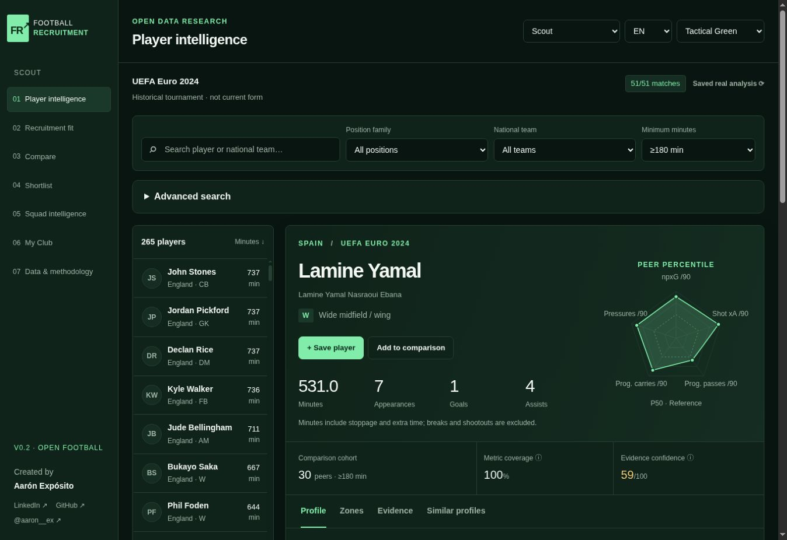
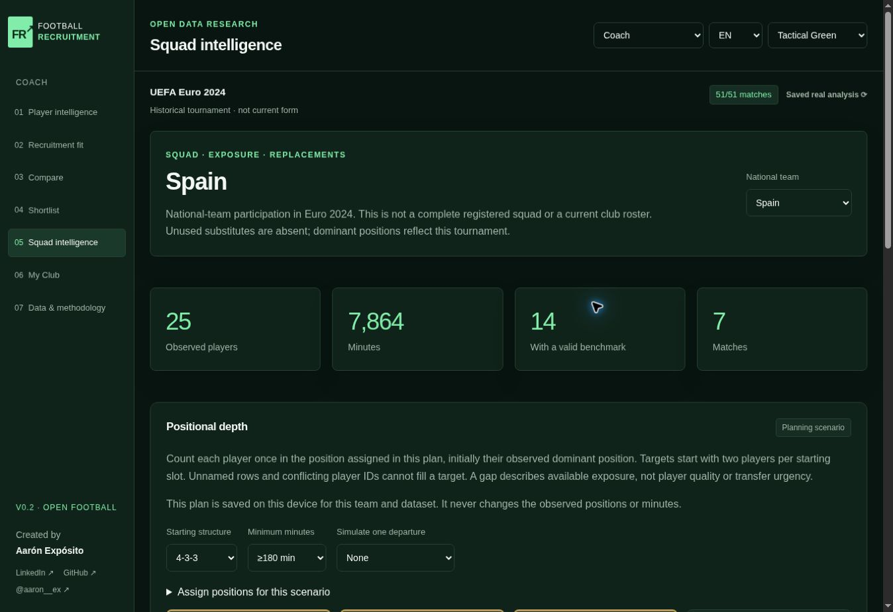
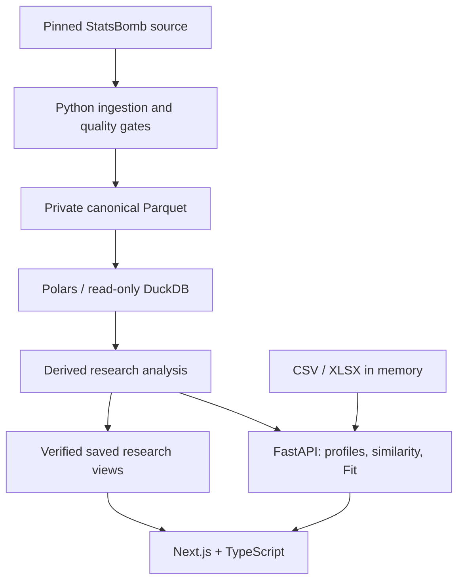

# Football Recruitment Platform

**Explainable football recruitment research — built by Aarón Expósito.**

A complete Python and TypeScript product that turns event observations into player profiles, comparable metrics and transparent recruitment briefs. It helps a scout answer **“Why does this player appear here, compared with whom, and how much evidence supports it?”**

The working research dataset covers **Euro 2024: 51 matches, 187,924 events, 493 players with playing time and 24 national teams**. All catalog players and football observations are real. No API key, subscription or paid data service is required.



*Actual application capture, not a mockup. Independent research using StatsBomb Open Data.*

<a href="https://github.com/hudl/open-data"></a>

[Run locally](#run-locally) · [Demo walkthrough](docs/DEMO_GUIDE.md) · [Publish](docs/PUBLISHING.md) · [Data rights](DATA_SOURCES.md) · [Metric methodology](docs/METRIC_GOVERNANCE.md)

## The problem

Event totals reward playing time. Unqualified per90 rankings exaggerate small samples. Similar-looking numbers can come from different positions and contexts. An unexplained fit score can be mistaken for player quality.

This platform keeps the observation, denominator, comparison group, missing information and recommendation logic visible. It supports a human scouting process; it does not claim to replace video, tactical context or a sporting decision.

## What you can use

| Workflow | Implemented behaviour |
| --- | --- |
| Player discovery | Search names and national teams in EN/ES/FR. Filter by position, minutes, metric coverage, evidence confidence and percentile thresholds. Filters never redefine the reference cohort. |
| Real player profiles | Minutes, match context, totals, 20 event rates plus pass completion, percentile bars, radar, source lineage and explicit unavailable evidence. |
| Similarity | Standardized distance across mutually observed dimensions, reference support, candidate filters and metric-by-metric explanations. Statistical likeness is not proof of tactical interchangeability. |
| Recruitment Fit | Eleven curated archetypes, editable weights, hard limits, eligibility and ranked candidates. Fit, weighted brief coverage and confidence remain separate. |
| Comparison and shortlist | Compare up to three players; save players, review status and notes; export formula-safe CSV with source identities, totals and rates. |
| Visual analysis | Coarse 6×4 shot zones, pass origins, progressive pass/carry flows and defensive activity, with match filters. No exact source events are redistributed. |
| Squad planning | Observed national-team participation, editable positional targets, one assignment per player and a departure scenario. Gaps describe exposure, not transfer urgency. |
| My Club | CSV/XLSX preview, column mapping, decimal convention, missing-data checks, per90 calculations, structural quality and positional depth. A real Spain sample goes through the same parser as uploaded files. |
| Product experience | Scout, Sporting Director, Coach, Analyst and Player entry points; EN/ES/FR; three themes; keyboard profile tabs; loading, empty, error and service-reconnection states. |



The persona selector changes the starting workflow, not permissions. Watchlists, notes, comparisons, preferences and research squad/brief inputs are stored on the current device, with validation on restore. There are no accounts or cloud synchronization. Imported files are processed in server memory and not saved. Import results and per-team plans survive module navigation but clear on reload or reanalysis. Only upload material you have permission to process; this public research showcase is not a confidential club workspace.

## Run locally

Requirements: **Python 3.12, Node.js 24 and npm**. Git is needed for cloning and the publication checks. Linux is the validated installation target; Windows process lifecycle remains unverified.

After cloning the repository, open its root and run:

```bash
python scripts/dev.py --install
```

Open **http://127.0.0.1:3000**. The launcher installs constrained Python dependencies and the npm lockfile, then starts FastAPI and Next.js. It reports readiness only after both respond. No football data is downloaded. Ctrl+C stops both services.

Next time:

```bash
python scripts/dev.py
```

The complete derived analysis is included. Custom briefs and My Club use FastAPI; search, profiles, comparisons, similarity and preset briefs can still use the verified saved analysis during an API outage. The data-status button shows which mode is active. An unavailable operation is disabled rather than simulated.

For separate processes, copy `.env.example` to `apps/web/.env.local` and set `FRP_API_URL` to the private backend address. Python environment overrides must be supplied by the shell or hosting platform; Python does not automatically load that file. See [deployment configuration](docs/PUBLISHING.md).

## Architecture and stack



| Layer | Responsibility |
| --- | --- |
| `core/pipeline` | Immutable source revision, input SHA256, stable namespaced IDs, canonical schemas, atomic publication and offline replay. |
| `core/analytics` | Exposure, feature definitions, rates, fixed cohorts, percentiles, evidence, similarity, fit and import validation. |
| `apps/api` | FastAPI/Pydantic response contracts, validated snapshot serving, bounded uploads and dataset readiness. No source-provider request during serving. |
| `apps/web` | Next.js/React/TypeScript, server-side API proxy, runtime payload checks, translated views and device-local user choices. |
| `scripts`, `tests` | Independent mathematical audits, backend/frontend tests, real HTTP integration, launcher lifecycle and clean-clone rehearsal. |

ML is used only where justified: similarity is an explicit statistical distance, and archetypes are curated hypotheses. There is no claimed learned role-discovery, transfer-success predictor or universal quality model. [Architecture details](docs/ARCHITECTURE.md) · [Source and methodology screenshot](docs/screenshots/data-methodology.jpg).

## Methodology that can be inspected

- **Minutes:** reconstructed from period clocks and participation intervals, including added and extra time; breaks and shootouts excluded. Incomplete inputs fail publication.
- **Per90:** sum of observed numerators divided by observed minutes, multiplied by 90. Missing is not zero. Pass completion uses completed/attempted passes, not minutes.
- **Percentiles:** same dataset, competition, season, gender and dominant position; reference exposure ≥180 minutes and ≥10 observed peers per metric. Midranks handle ties; control-loss direction is reversed. Sparse, goalkeeper and unknown-position benchmarks are withheld.
- **Similarity:** RMS distance over standardized shared, nonconstant dimensions; at least three, each with ten reference observations. Candidate filters do not recalculate the reference.
- **Fit:** weighted, direction-aware logistic transformation of comparable requirements. Missing mandatory evidence cannot pass a hard constraint. The explanation exposes each component.
- **Confidence:** an evidence-depth heuristic based on exposure, observed comparable metrics and per-metric reference support. It is not a calibrated probability.
- **Imports:** cross-source or altered observations are not benchmarked silently against Euro 2024. Only unchanged, identifiable canonical round-trips can receive that reference.

**Fit Score ≠ Player Quality ≠ Confidence ≠ Data Coverage.** Import structural quality is a separate passed/total validation measure. See [metric governance](docs/METRIC_GOVERNANCE.md) for definitions and formulas.

## Data provenance and rights

Source revision: `4b73468fc5b0f1950f9f66fada70ad3a4f9327cb` · Dataset: `c6b20c36ee58c5b18c3e` · Schema: `2.0.0` · Features: `2.1.1` · Minutes: `period-clock-v1.1`.

**StatsBomb Open Data has a custom noncommercial research agreement, not an unrestricted open licence.** Attribution and logo accompany public analysis. Raw redistribution and commercial exploitation, including derived analysis, are restricted. MIT applies to original code; it does not grant rights to provider material. No commercial scouting licence is included.

Original JSON, lineups and event Parquet stay in `data/cache`, excluded from Git and Docker contexts. The repository contains derived research summaries and coarse zones, not a raw event API. Read [DATA_SOURCES.md](DATA_SOURCES.md), [third-party notices](THIRD_PARTY_NOTICES.md) and the [pinned agreement](https://github.com/hudl/open-data/blob/4b73468fc5b0f1950f9f66fada70ad3a4f9327cb/LICENSE.pdf) before publishing or reusing data.

## Reproduce the analysis

Activate `.venv` first (`source .venv/bin/activate` on Linux/macOS):

```bash
python -m core.pipeline.cli
python -m core.pipeline.cli --offline
python -m scripts.export_analysis
python -m scripts.validate_analysis
```

Only the first command downloads provider inputs. The offline run verifies cache integrity. Failed ingestion preserves the last valid publication. A repeated dataset ID must reproduce semantic content and Parquet hashes. `--limit` produces an explicitly partial dataset; `--revision` requires an immutable commit.

## Tests and reproducibility

With `.venv` activated:

```bash
python -m pytest -q
python -m ruff check core apps/api scripts tests
python -m ruff format --check core apps/api scripts tests
python -m scripts.check_publication
python -m scripts.validate_analysis
npm test
npm run typecheck
npm run lint
npm run format:check
npm run build
python -m scripts.verify_stack --standalone
python -m scripts.verify_dev --production
```

`verify_stack` runs production Next.js and real FastAPI against an empty private cache. It checks search, profile, similarity, custom hard-constrained Fit, maps, CSV/XLSX, canonical/altered imports, the real Spain demo, outage fallback and security headers. Responses pass the same TypeScript validators as the UI. The separate publication audit checks every denominator, percentile, similarity reference and Fit explanation.

To rehearse from a fresh local Git clone, with new dependency directories and the README launcher:

```bash
python -m scripts.verify_clean_checkout
```

Exact results and scope are recorded in [HANDOFF_STATE.md](HANDOFF_STATE.md) and `docs/validation`. An HTTP integration pass is not a claim that every browser upload/download interaction passed. GitHub Actions is configured but an external run must pass on the published repository.

## Public demo and current limitations

[Publishing instructions](docs/PUBLISHING.md) cover a single free Render web service, the supplied Dockerfile/blueprint and local Docker Compose. The application has no paid runtime dependency. Hosting has provider quotas and cold starts; no paid plan is necessary for the documented demo route. No public URL is claimed until deployment and hosted checks succeed.

Current limits: one historical men's tournament; no age, preferred foot, injuries, contracts, prices, tracking, current club or league-strength adjustment. Per90 is not possession-adjusted. There is no authentication or shared private workspace. This is a research showcase, not a licensed commercial decision service.

Outstanding acceptance gates are explicit in the handoff: interactive browser custom Fit and My Club with a reachable Python backend, mobile viewport checks, browser file-download completion and hosted/container execution. Desktop saved-analysis walkthroughs and real HTTP integrations cover different parts of these flows; they are not interchangeable evidence.

## Roadmap

1. Close the remaining browser/mobile/hosted acceptance gates and publish the verified showcase.
2. Extend legal, reproducible competition coverage with explicit comparability rules.
3. Evaluate roles and tactical fit against a defensible validation target before adding learned models.

The current milestone deepens existing workflows. [Detailed roadmap](docs/ROADMAP.md) · [Interview notes](docs/INTERVIEW_CHEATSHEET.md) · [Repository description and presentation copy](docs/SHOWCASE_COPY.md).

## Author

**Aarón Expósito** · [LinkedIn](https://www.linkedin.com/in/aaronexpositomonar) · [GitHub](https://github.com/aaronexposito0-creator) · [Instagram @aaron__ex](https://www.instagram.com/aaron__ex/)
