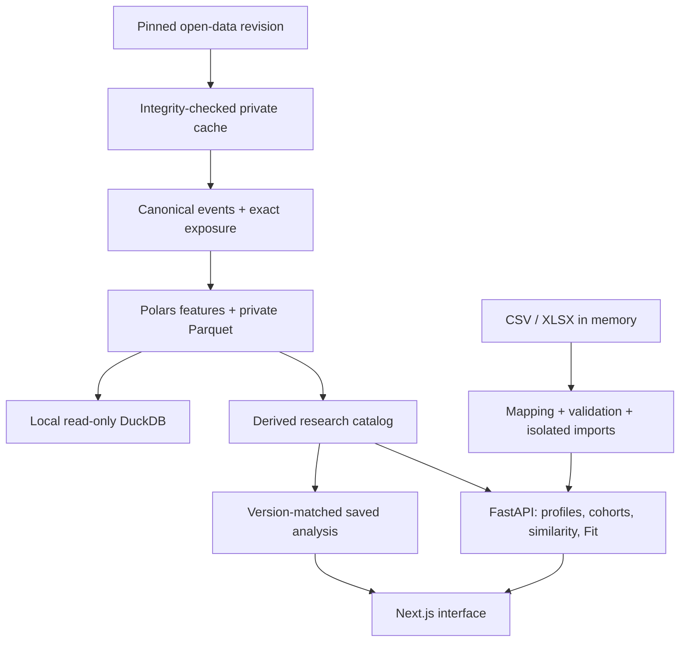

# Implemented architecture

This document describes running code. PostgreSQL schema drafts and the unused role-clustering experiment from v0.1 are not the operational warehouse or a deployed ML model.

## Boundaries and ownership

| Package | Responsibility |
| --- | --- |
| `core/pipeline/cache.py` | Pinned HTTP cache, URL/hash metadata, timeouts/retries, offline integrity and atomic files. |
| `canonical.py` | Stable source IDs; explicit Polars schema, event types, coordinates and progression primitives. |
| `minutes.py` | Starting XI, exact period clocks, substitutions, dismissals, temporary off/on, positional exposure and quality gates. |
| `metrics.py` | Versioned observed totals, null propagation, sums-before-rates and metric catalog. |
| `spatial.py` | Private coordinate processing; publication of coarse event-zone aggregates and flows. |
| `build.py` | Bounded concurrent match processing, manifest/fingerprint, immutable staging/publication and reproducibility checks. |
| `warehouse.py` | Read-only DuckDB views over local Parquet. No arbitrary SQL HTTP endpoint. |
| `core/analytics` | Cohorts, midrank percentiles, evidence, similarity, weighted Fit, curated archetypes, import validation. |
| `apps/api/app` | Typed FastAPI contracts, loaded-dataset integrity checks and explicit HTTP failures. |
| `apps/web/lib` | Typed contracts, API/fallback handling, pure search/depth logic, i18n and safe exports. |
| `apps/web/components` | Product workflows. No provider downloads or invented football measurements. |
| `scripts/export_analysis.py` | Same Python functions generate saved research views for a provider-free runtime. |

## Serving contract

`FRP_DATA_DIR/CURRENT.json` chooses a locally built immutable dataset. If the pointer is absent, the server uses `FRP_SNAPSHOT` / bundled `data/sample/analysis.json`. A corrupt existing pointer/catalog produces 503; it is not silently replaced by another dataset. The loader validates player identities, finite numbers, manifest counts and a single competition-season-gender context.

The frontend talks through an allowlisted Next server route to `FRP_API_URL` (default loopback FastAPI). No caller-controlled backend URL, redirect following or raw event path. JSON briefs/search requests are capped at 32,000 bytes; CSV/XLSX preview at 3 MiB; mapped import JSON at 8 MiB. Uploads have independent Python stream limits. The backend does not save uploaded files.

Saved profiles/similarity/visuals must match the loaded catalog dataset ID. Aborted selections cannot trigger a stale fallback. An unavailable API leaves research browsing operational and labels the connection state; custom calculations never masquerade as successful saved calculations.

`apps/web/lib/validation.ts` checks runtime publication shape, finite/null observations, identity, score ranges and evidence eligibility before rendering. Profiles, similarity and maps must match both the dataset and the requested player. A malformed API catalog can use the validated saved catalog; two invalid sources produce the normal error state. Independent comparison columns retain valid players and removal controls when another selection fails or is absent. All 493 published profile/similarity/map responses and saved Fit views are exercised through these same guards by Node tests.

Fit validation also matches the complete requested brief, normalizing optional API defaults, and reconciles weights, normalized requirement scores, contributions and weighted coverage. Too-small references retain the requested brief/context in their typed response and receive a distinct translated empty state. Public profile/similarity reference exposure is fixed; candidate filters cannot redefine it. Every similarity dimension carries an observed reference count and requires ten observations before standardization.

My Club preview/analysis boundaries validate table dimensions, original row lineage, mapping fields, isolated import identities, null-aware rates, coverage and external benchmark consistency before updating state. The production HTTP runner sends actual FastAPI responses through these TypeScript validators, covering both CSV and XLSX, unchanged canonical imports and modified observations without benchmarks. Search pending state withholds the previous query's result buttons; late cancelled profile/map requests cannot publish state. Shared team localization lives in `core/reference/team_names.json`, while source names remain the filter and persistence keys.

Shared `core/reference/import_limits.json` distinguishes auxiliary preview cells (4096 Unicode code points) from mapped football fields (256). Python and TypeScript use the same limits, including supplementary Unicode characters. The mapping helper returns field/column/source-row context without copying note text into an error. The UI blocks invalid mappings and clears obsolete errors when the mapping, decimal convention or import label changes. Unmapped notes contribute no observations and are not saved into the notebook. The real CSV exporter is exercised through preview, analysis and runtime validation with its full 54-column output and a 3000-character note.

Recruitment result pagination is presentation-only: all API results retain their original order and scores. The visible window is keyed by dataset, full requested brief signature and eligibility filter. A changed criterion starts at 30; language changes and returning from a player profile preserve an expanded window. A translated shown/total count and expansion button expose the remaining candidates.

Imported profiles retain `source_player_id` separately from their isolated row ID. Duplicate source IDs must carry an explicit issue and have neither benchmark nor confidence; squad depth excludes those rows even after team/position filtering. Structural quality carries integer passed/total checks, reconciled with the displayed percentage. Row diagnostics are application checks, not provider claims.

Verified imported confidence is reconstructed at the frontend boundary from minutes and per-metric reference support, rather than only bounded by coverage and the canonical profile's confidence. Reference counts are cached per dataset/competition/season/gender/position within one validation call. Only imported observations with an available percentile add support; the denominator remains the whole metric catalog. The backend calculation was already correct; this closes acceptance of inconsistent partial-import responses.

Import numerator constraints live in `core/reference/import_metric_bounds.json`, packaged with Python and consumed directly by the web response guard. Bounds include direct, transitive and sum relations. The backend evaluates every available bound against the parsed totals before withholding contradictions; it never uses missing components as zero. Rates/quality/coverage then derive from the remaining valid observations. Regression fixtures cover missing and rejected intermediate totals, compound box-entry bounds and translated issue explanations; the production HTTP runner passes an inconsistent CSV through preview, analysis and the browser validator.

Browser history stores module, selected player and validated search criteria, scoped to the dataset. Back/Forward restore that state; unknown player links remain explicit missing states. Local storage keeps bounded preferences, shortlist IDs, notes and comparison IDs in separate validated records. Brief inputs and squad scenarios are scoped by dataset, with squad plans additionally scoped by team; no scores are stored as user preferences. Mounted panels preserve work across module navigation, but dataset changes remount analytical panels so old import/reference results cannot survive. Imports remain tab-memory only. The shared `DepthPlan` view accepts controlled scenario inputs: published squads use validated device storage, while My Club owns per-team plans in an import-scoped memory reducer. Reanalysis resets the map; stale edits with an old import ID are ignored.

## Development and deployment scope

`scripts/dev.py` waits for actual FastAPI and Next readiness and returns a failure code if either service cannot start or exits unexpectedly. POSIX services receive separate owned process groups so shutdown includes Next descendants; Windows uses the owned PID tree. The separate Linux `scripts/verify_dev.py` runner checks actual catalog access, SIGTERM cleanup, occupied API/web ports and absence of a false ready message. It does not install dependencies or substitute for browser tests.

Root npm commands delegate to the existing frontend package. The development wrapper accepts standard Next flags and supervised preview flags, uses the correct frontend working directory and optionally starts a prepared local Python backend. `scripts/dev.py` handles installation and owns both services when used. Production build output and development output use separate Next directories.

The validated HTTP smoke runner starts production Next and FastAPI in one process environment, without private source cache. A multi-user public upload service would additionally need deployment-specific authentication/access policy, rate limits and an explicit data-retention agreement. No public deployment, accounts or persistent club database is claimed here.

## Showcase hosting boundary

The root `Dockerfile` packages production standalone Next.js and the real Python API into one service. `scripts/serve.py` checks both ports, waits for validated API readiness, binds FastAPI only to loopback and stops both owned process groups on shutdown or a child failure. Only the Next port is public. The Render blueprint selects the Free plan; it needs no database, provider key, uploaded-file storage or original event cache. Docker Compose offers the same boundary as two local containers. Container builds and hosted resource behaviour remain separate acceptance gates from a native production-supervisor test.

`/health` confirms the API process; `/ready` additionally confirms a valid dataset. Next applies security headers, an allowlisted backend route and same-origin POST checks. This does not provide user authentication or a guarantee against denial of service. Public imports remain memory-only, bounded research inputs; confidential club data is outside the showcase's intended use.

The root publication scanner inventories the files Git would include, including tracked files subsequently ignored, without creating project history. It rejects private source caches, warehouse outputs, environment files, keys, token patterns and local workspace paths. `verify_clean_checkout` makes a temporary local Git origin and clone, installs fresh dependencies via the README launcher and executes the numerical, HTTP, lint, build and production-lifecycle gates. It does not publish a remote or claim a GitHub Actions run.

## Deliberate limits

- One competition-season-gender per analysis catalog; no cross-league pooling.
- Single team per player-season in the published grain. Transfers fail clearly rather than overwrite an identity.
- Derived JSON serving is appropriate for this 493-player research slice; large historical event queries stay in Parquet/DuckDB.
- No queued ingestion service or production observability stack claimed. CLI runs, manifests and independent reports are the current operational tools.
- No paid services, hosted model endpoint, LLM, tracking or learned role discovery on the primary path.
